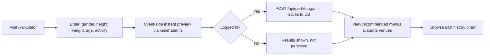
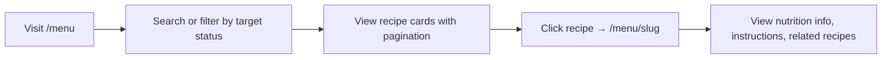
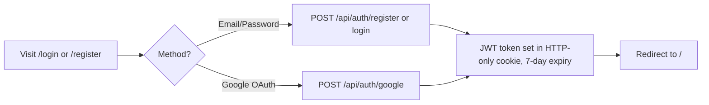
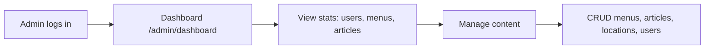
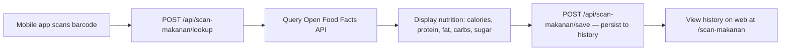
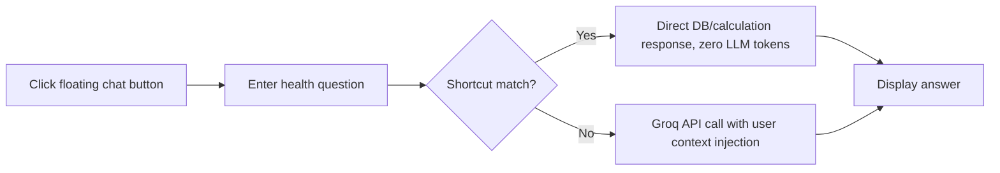
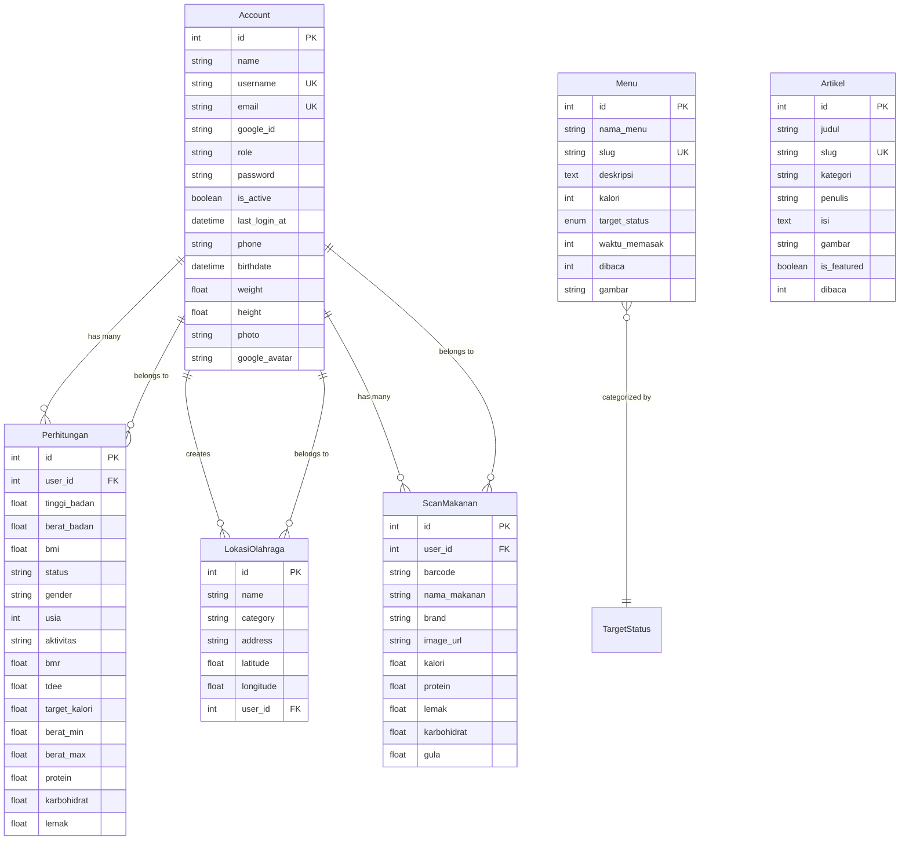

# FitLife — Product Requirements Document (PRD)

> **Source of truth**: Current codebase at commit `29068e5` on branch `update-gitig`.
> **Generated**: 2026-10-04
> **Project name**: `project-fitlife` v0.1.0

---

## Table of Contents

1. [Product Overview](#1-product-overview)
2. [Product Goals](#2-product-goals)
3. [Existing Features](#3-existing-features)
4. [Target Users](#4-target-users)
5. [Main User Flows](#5-main-user-flows)
6. [Page / Route Inventory](#6-page--route-inventory)
7. [Navigation Structure](#7-navigation-structure)
8. [Feature Details](#8-feature-details)
9. [Existing UI / Design System](#9-existing-ui--design-system)
10. [Database Entities and Relationships](#10-database-entities-and-relationships)
11. [Prisma Schema and Important Models](#11-prisma-schema-and-important-models)
12. [API / Backend Integrations](#12-api--backend-integrations)
13. [Authentication and Authorization](#13-authentication-and-authorization)
14. [State Management and Data Flow](#14-state-management-and-data-flow)
15. [Important Business Rules](#15-important-business-rules)
16. [Dependencies and External Services](#16-dependencies-and-external-services)
17. [Platform / Environment Requirements](#17-platform--environment-requirements)
18. [Current Limitations or Known Issues](#18-current-limitations-or-known-issues)
19. [Important Technical Constraints](#19-important-technical-constraints)
20. [Feature-to-Page/Component Mapping](#20-feature-to-pagecomponent-mapping)
21. [Acceptance Criteria for Existing Major Features](#21-acceptance-criteria-for-existing-major-features)

---

## 1. Product Overview

**FitLife** (branded as *Fitlife.id*) is a health and fitness web platform built with Next.js (App Router). It helps users assess their body health through BMI/BMR/TDEE calculations, discover healthy meal recipes matched to their nutritional needs, read health articles, find nearby sports facilities on an interactive map, scan packaged food barcodes for nutrition data, and chat with an AI health assistant (FitBot).

The platform serves two distinct user segments through route groups:
- **Client-facing pages** (`/(client)`) — public and authenticated users browse content and use health tools.
- **Admin dashboard** (`/(admin)`) — administrators manage all content (menus, articles, locations, users).

A companion **mobile app** (Flutter) integrates via the same REST API for barcode scanning and authentication.

### Tech Stack

| Layer | Technology |
|---|---|
| Framework | Next.js 16.1.6 (App Router), React 19.2.3, TypeScript 5 |
| Styling | Tailwind CSS v4, Framer Motion, GSAP |
| Database | PostgreSQL via `pg` + `@prisma/adapter-pg` |
| ORM | Prisma 7.4.2 |
| Auth | JWT (HS256 via `jose`), bcryptjs, Google OAuth |
| Validation | Zod 4.3.6 |
| Media Storage | Cloudinary |
| Maps | Leaflet + react-leaflet |
| Rich Text | Tiptap (starter-kit, image, link, color, code-block) |
| AI Chat | Groq Cloud API (model `qwen/qwen3.8-27b`) |
| Barcode Data | Open Food Facts API |
| Testing | Vitest 4.1.7 |

---

## 2. Product Goals

> **Status**: *Inferred from codebase features and UI copy.*

1. **Empower personal health awareness** — provide accessible BMI, BMR, and TDEE calculations with actionable nutritional recommendations.
2. **Guide healthy eating** — curate recipes categorized by BMI target status (Kurus, Normal, Berlebih, Obesitas) with calorie and macronutrient information.
3. **Encourage physical activity** — map sports facilities near the user, filtered by exercise types appropriate to their BMI category.
4. **Educate users** — publish health and fitness articles with rich content.
5. **Track nutrition intake** — enable barcode scanning of packaged foods to review nutritional values (via mobile companion app).
6. **Provide AI health guidance** — offer a conversational AI assistant (FitBot) for health, fitness, and nutrition questions.

---

## 3. Existing Features

| # | Feature | Status |
|---|---|---|
| 1 | BMI / BMR / TDEE Health Calculator | ✅ Confirmed |
| 2 | Macronutrient Recommendation Engine | ✅ Confirmed |
| 3 | Healthy Recipe Directory (Menu Makanan Sehat) | ✅ Confirmed |
| 4 | Health Article CMS | ✅ Confirmed |
| 5 | Sports Facility Locator (Leaflet Map) | ✅ Confirmed |
| 6 | Packaged Food Barcode Scanner (via Open Food Facts) | ✅ Confirmed |
| 7 | AI Health Chatbot (FitBot via Groq) | ✅ Confirmed |
| 8 | Email/Password Authentication | ✅ Confirmed |
| 9 | Google OAuth (Web + Mobile) | ✅ Confirmed |
| 10 | User Profile Management | ✅ Confirmed |
| 11 | Avatar Upload (Cloudinary) | ✅ Confirmed |
| 12 | Admin Dashboard with Analytics | ✅ Confirmed |
| 13 | Admin Menu CRUD | ✅ Confirmed |
| 14 | Admin Article CRUD with Rich Text Editor | ✅ Confirmed |
| 15 | Admin Location CRUD with Map Picker | ✅ Confirmed |
| 16 | Admin User Management (activate/suspend/delete) | ✅ Confirmed |
| 17 | BMI History Tracking & Chart | ✅ Confirmed |
| 18 | Dark/Light Theme Toggle | ✅ Confirmed |
| 19 | PDF Export of Health Results | ✅ Inferred (jspdf + html2canvas in deps) |
| 20 | Mobile App Integration (Flutter) | ✅ Inferred (dual auth token paths, scan-makanan mobile flow) |

---

## 4. Target Users

> **Status**: *Inferred from UI copy, feature design, and Indonesian-language content.*

| Segment | Description |
|---|---|
| **Health-conscious individuals** | Users wanting to track BMI, calculate daily caloric needs, and receive personalized meal recommendations. |
| **Fitness beginners** | Users seeking nearby sports facilities appropriate for their fitness level. |
| **General public** | Readers of health/fitness articles and scanners of packaged food nutrition. |
| **Content administrators** | Admins who manage recipes, articles, sports locations, and user accounts. |

**Locale**: Indonesian (Bahasa Indonesia) — all UI labels, validation messages, and content are in Indonesian.

---

## 5. Main User Flows

### Flow 1: Health Assessment (BMI Calculator)



### Flow 2: Browse Healthy Recipes



### Flow 3: Authentication



### Flow 4: Admin Content Management



### Flow 5: Food Barcode Scanning



### Flow 6: AI Chatbot (FitBot)



---

## 6. Page / Route Inventory

### Client Pages (`/(client)`)

| Route | Component | Description |
|---|---|---|
| `/` | `Home` | Landing page with hero, feature cards, recent content |
| `/kalkulator` | `KalkulatorBMIPage` | BMI/BMR/TDEE calculator with results, map, chart |
| `/menu` | `MenuPage` | Recipe directory with search and filter |
| `/menu/[slug]` | `MenuDetailPage` | Recipe detail with nutritional info |
| `/artikel` | `ArtikelPage` | Article directory with category filter |
| `/artikel/[slug]` | `ArtikelDetailPage` | Full article view |
| `/lokasi` | `LokasiPage` | Sports facility map + list view |
| `/scan-makanan` | `ScanMakananPage` | Food scan history (web view) |
| `/profile` | `ProfilePage` | User profile editing |

### Auth Pages (`/(auth)`)

| Route | Component | Description |
|---|---|---|
| `/login` | `LoginPage` / `LoginClient` | Email/password + Google sign-in |
| `/register` | `RegisterPage` | Account creation |

### Admin Pages (`/(admin)/admin`)

| Route | Component | Description |
|---|---|---|
| `/admin/dashboard` | `BerandaPage` | Dashboard analytics |
| `/admin/menu` | `MenuPage` | Menu management table |
| `/admin/menu/create` | `CreateMenuPage` | Create recipe form |
| `/admin/menu/[slug]/edit` | `EditMenuPage` | Edit recipe form |
| `/admin/artikel` | `ArtikelPage` | Article management table |
| `/admin/artikel/create` | `CreateArtikelPage` | Create article with Tiptap editor |
| `/admin/artikel/[slug]/edit` | `EditArtikelPage` | Edit article |
| `/admin/lokasi` | `LokasiAdminPage` | Location management table |
| `/admin/lokasi/create` | `CreateLokasiPage` | Create location with map picker |
| `/admin/lokasi/[id]/edit` | `EditLokasiPage` | Edit location |
| `/admin/pengguna` | `PenggunaPage` | User management |
| `/admin/profile` | `AdminProfilePage` | Admin profile settings |

### API Routes (`/api`)

| Endpoint | Methods | Auth |
|---|---|---|
| `/api/auth/register` | POST | Public |
| `/api/auth/login` | POST | Public |
| `/api/auth/google` | POST | Public |
| `/api/auth/me` | GET | Authenticated |
| `/api/auth/logout` | POST | Public |
| `/api/accounts` | GET | Admin |
| `/api/accounts/[id]` | PATCH, DELETE | Admin |
| `/api/admin/dashboard` | GET | Admin |
| `/api/profile` | GET, PATCH | Authenticated |
| `/api/profile/password` | PATCH | Authenticated |
| `/api/profile/upload` | POST | Authenticated |
| `/api/perhitungan` | GET, POST, DELETE | Authenticated (POST also public) |
| `/api/menus` | GET, POST | Public (GET), Admin (POST) |
| `/api/menus/[slug]` | GET, PUT, DELETE | Public (GET), Admin (PUT/DELETE) |
| `/api/upload/menu` | POST | Authenticated |
| `/api/artikels` | GET, POST | Public (GET), Admin (POST) |
| `/api/artikels/[slug]` | GET, PUT, DELETE | Public (GET), Admin (PUT/DELETE) |
| `/api/lokasi-olahraga` | GET, POST | Public (GET), Admin (POST) |
| `/api/lokasi-olahraga/[id]` | GET, PUT, DELETE | Public (GET), Admin (PUT/DELETE) |
| `/api/scan-makanan` | GET, DELETE | Authenticated |
| `/api/scan-makanan/lookup` | POST | Public |
| `/api/scan-makanan/save` | POST | Authenticated |
| `/api/chat` | POST | Authenticated |

---

## 7. Navigation Structure

### Client Navbar

```
Logo (Fitlife.id) → Home | Menu | Artikel | Kalkulator | Lokasi | Scan Makanan
                                                           [Theme Toggle] [Profile Avatar / Login]
```

- `NavProfile` component shows avatar dropdown with links to Profile and Logout.
- Floating `ChatButton` opens the AI assistant overlay.

### Admin Sidebar

```
Dashboard
├── Menu
├── Artikel
├── Lokasi
├── Pengguna
└── Profile
```

- Collapsible sidebar with mobile overlay support.
- Framer Motion page transitions.

---

## 8. Feature Details

### 8.1 BMI / BMR / TDEE Health Calculator

- **Input**: Gender (Pria/Wanita), Height (cm), Weight (kg), Age, Activity Level (Rebahan/Ringan/Sedang/Berat).
- **Output**: BMI value + status category, BMR, TDEE, ideal weight range, protein/fat/carbs recommendations.
- **Client-side preview**: Instant calculation via `lib/kesehatan.ts` before form submission.
- **Persistence**: Authenticated users' results stored in `Perhitungan` table; weight/height synced to `Account`.
- **History**: GET endpoint returns last 10 calculations; chart visualization via `BMIRiwayatChart`.
- **Recommended content**: Menus and sports venues filtered by calculated BMI status.

### 8.2 Healthy Recipe Directory

- **Filtering**: By `TargetStatus` enum (Kurus, Normal, Berlebih, Obesitas), debounced text search (400ms).
- **Pagination**: Client-side, 9 items per page.
- **Detail page**: Shows cover image, calorie count, cooking time, target category, full description, and related recipes.
- **Read counter**: Auto-incremented on detail page view (`dibaca: { increment: 1 }`).
- **Admin CRUD**: Full create/edit/delete with Cloudinary image upload, Zod validation (`MenuSchema`).

### 8.3 Health Article CMS

- **Content**: Rich HTML via Tiptap WYSIWYG editor (bold, italic, underline, headings, lists, images, links, code blocks, text alignment, colors).
- **Filtering**: By category (dynamic from data), featured toggle, debounced search.
- **Read counter**: Auto-incremented on article detail view.
- **Featured articles**: `is_featured` flag displayed prominently in hero sections.

### 8.4 Sports Facility Locator

- **Map**: Leaflet with custom markers, popup details, and Google Maps routing link.
- **Categories**: `gym` (for underweight), `lapangan` (for normal BMI), `low_impact` (for overweight/obese).
- **Geolocation**: Browser GPS detection with Haversine distance calculation to venues.
- **Views**: Toggle between Map view and List card view.
- **Admin**: Map picker component (`LokasiPickerMap`) with click-to-place pin, reverse geocoding, and location search.

### 8.5 Food Barcode Scanner

- **Lookup**: Queries Open Food Facts API with barcode (3–64 digit validation).
- **Nutrition data**: Calories, protein, fat, carbohydrates, sugar per 100g.
- **Save**: Persists scan history to `ScanMakanan` table for authenticated users.
- **Web view**: History list with delete capability; promotional CTA for mobile app when not logged in.

### 8.6 AI Health Chatbot (FitBot)

- **Provider**: Groq Cloud API, model `qwen/qwen3.8-27b`.
- **Context injection**: User's physical profile (height, weight) and latest BMI calculation from DB.
- **Zero-token shortcuts**: Three predefined queries answered locally without LLM call.
- **Guardrails**: Only responds to health/fitness/nutrition topics; refuses code generation requests.
- **Resilience**: Exponential backoff retry (3 attempts, 2s/4s/8s) on HTTP 429 and 503.
- **Sliding window**: Last 4 messages sent as conversation context.

### 8.7 User Profile Management

- **Editable fields**: Name, username (unique), phone, birthdate, weight, height.
- **Avatar**: Drag-and-drop upload to Cloudinary (max 2MB, jpg/png/webp, auto-crop 400×400 face focus).
- **Password change**: Requires current password verification; min 8 chars, bcrypt salt 12.
- **Cross-component sync**: `profile:updated` custom event broadcasts avatar changes to Navbar.

### 8.8 Admin Dashboard

- **Stats cards**: Total users, active users, total menus, total articles (animated counters).
- **Top content**: 5 most-viewed menus, 5 newest registered users.
- **User management**: Activate/suspend toggle, permanent deletion with cascade.

---

## 9. Existing UI / Design System

### Component Library

| Component | Source | Usage |
|---|---|---|
| `Button` | shadcn/ui (CVA + Tailwind) | Primary action buttons across forms |
| `Card`, `CardHeader`, `CardTitle`, etc. | shadcn/ui | Content cards for menus, articles, stats |
| `Input`, `Label` | shadcn/ui | Form inputs |
| `AuthLink` | Custom | Navigation links on auth pages |
| `SubmitButton` | Custom | Loading-state submit button |
| `AuthLayout` | Custom | Auth page container with branded hero |
| `LayoutAdmin` | Custom | Admin shell with sidebar/header |
| `RichTextEditor` | Custom (Tiptap) | WYSIWYG article content editor |
| `LokasiPickerMap` | Custom (Leaflet) | Interactive map pin picker |
| `LokasiMap` | Custom (Leaflet) | Read-only map display for client |
| `HomeRecentContent` | Custom | Paginated recent menus/articles widget |
| `NavProfile` | Custom | Avatar dropdown with logout |
| `TrueFocus` | Custom | Animated text effect on 404 page |
| `ThemeProvider` | next-themes | Dark/light mode wrapper |
| `BMIRiwayatChart` | Custom | BMI history line chart |
| `Toaster` | Sonner | Toast notifications |

### Design Tokens

- **Font**: Inter (Google Fonts).
- **Theme**: Dark/light mode via `next-themes` with CSS class strategy.
- **Utility**: `cn()` helper combining `clsx` + `tailwind-merge` for conditional class merging.
- **Icons**: Lucide React, React Icons.
- **Animations**: Framer Motion (page transitions, counter animations), GSAP.
- **Toasts**: Sonner (`top-center`, rich colors).

---

## 10. Database Entities and Relationships



**Cascade delete**: Deleting an `Account` cascades to `Perhitungan`, `LokasiOlahraga`, and `ScanMakanan`.

**Standalone tables**: `Menu` and `Artikel` have no foreign key relationships — they are content entities managed by admins.

---

## 11. Prisma Schema and Important Models

- **Generator**: `prisma-client-js`, output to `../generated/prisma`.
- **Datasource**: PostgreSQL via `@prisma/adapter-pg`.
- **Enum**: `TargetStatus` — `Kurus | Normal | Berlebih | Obesitas`.
- **6 Models**: `Account`, `Menu`, `Artikel`, `LokasiOlahraga`, `Perhitungan`, `ScanMakanan`.
- **3 Migrations**:
  1. `20260318173822_add_slug_menu` — initial schema with accounts, menus, artikels, makanan, perhitungan.
  2. `20260414135955_add_lokasi_favorit` — added `lokasi_olahraga` table.
  3. `20260919112000_add_scan_makanan` — added `scan_makanan` table.
- **Factories**: `artikelFactory.ts` and `menuFactory.ts` for seed data generation using `@faker-js/faker`.

---

## 12. API / Backend Integrations

### Internal API (Next.js Route Handlers)

23 route files organized by resource. See [Section 6](#6-page--route-inventory) for the complete list.

### External Services

| Service | Purpose | Integration Point |
|---|---|---|
| **Cloudinary** | Image upload and transformation | `POST /api/profile/upload`, `POST /api/upload/menu` |
| **Google OAuth** | Social authentication | `POST /api/auth/google` (web: userinfo API, mobile: tokeninfo API) |
| **Open Food Facts** | Barcode nutrition lookup | `POST /api/scan-makanan/lookup` |
| **Groq Cloud** | AI chat inference | `POST /api/chat` (model: `qwen/qwen3.8-27b`) |
| **Nominatim / OSM** | Reverse geocoding in map picker | `LokasiPickerMap` component (client-side) |

---

## 13. Authentication and Authorization

### Token Mechanism

- **Algorithm**: HS256 JWT via `jose` library.
- **Secret**: `process.env.JWT_SECRET`.
- **Payload**: `{ userId: number, role: string, email: string }`.
- **Expiry**: 7 days.
- **Storage**: HTTP-only secure cookie named `token` (web), `Authorization: Bearer` header (mobile/API).

### Auth Resolution (`getAuthUser`)

1. Check `Authorization: Bearer <token>` header.
2. Fallback to `token` cookie via `next/headers cookies()`.
3. Verify JWT signature and return payload or `null`.

### Authorization Levels

| Level | Check | Applied to |
|---|---|---|
| **Public** | No auth required | Menu/article GET, barcode lookup, register, login |
| **Authenticated** | Valid JWT with `userId` | Profile, perhitungan, scan history, chat, file upload |
| **Admin** | Valid JWT with `role === "admin"` | All CRUD operations, dashboard, user management |

### No Middleware

There is no Next.js middleware file. Auth enforcement is handled per-route inside API handlers and client components via `getAuthUser()` calls.

---

## 14. State Management and Data Flow

### Client-Side State

- **No global state library** (no Redux, Zustand, Jotai).
- **React `useState` / `useEffect`** for all local component state.
- **Custom events**: `profile:updated` broadcasts avatar/name changes from profile page to `NavProfile` component.
- **Context**: `ChatContextProvider` wraps client layout for AI chatbot state.

### Data Fetching Pattern

- **Client components** (`"use client"`) fetch data via `fetch()` calls to `/api/*` endpoints in `useEffect`.
- **No server components** fetching data directly — all data flows through API routes.
- **Optimistic UI**: Form submissions show loading states; success redirects or toast notifications.

### Cookie-Based Session

- JWT stored in HTTP-only cookie; no client-side token access for XSS protection.
- Mobile clients use `Authorization` header instead.

---

## 15. Important Business Rules

### Health Calculations

| Rule | Formula | Source |
|---|---|---|
| BMI | `weight / (height_m)²` | `lib/kesehatan.ts` |
| BMI < 18.5 | Status: Kurus | Confirmed |
| 18.5 ≤ BMI < 25 | Status: Normal | Confirmed |
| 25 ≤ BMI < 30 | Status: Berlebih | Confirmed |
| BMI ≥ 30 | Status: Obesitas | Confirmed |
| BMR (Male) | `10×W + 6.25×H - 5×Age + 5` | Mifflin-St Jeor |
| BMR (Female) | `10×W + 6.25×H - 5×Age - 161` | Mifflin-St Jeor |
| TDEE | `BMR × Activity Factor` | Factors: 1.2, 1.375, 1.55, 1.725 |
| Ideal Weight | `[18.5×H_m², 24.9×H_m²]` | Standard BMI range |
| Protein | `Weight × 1.4 g/day` | Confirmed |
| Fat | `(TDEE × 0.30) / 9 g/day` | Confirmed |
| Carbs | `(TDEE - Protein×4 - Fat×9) / 4 g/day` | Confirmed |

### Content Rules

- **Slugs**: Auto-generated from title/name + numeric timestamp for uniqueness.
- **Read counter**: Incremented atomically on each detail page GET request.
- **Featured articles**: Boolean flag, filterable on admin and highlighted on client.
- **Menu categorization**: Each recipe tagged with exactly one `TargetStatus` value.

### Location-to-BMI Mapping

| BMI Status | Recommended Exercise Category |
|---|---|
| Kurus | `gym` (strength training) |
| Normal | `lapangan` (field/community sports) |
| Berlebih | `low_impact` (low-impact cardio) |
| Obesitas | `low_impact` (aquatic/walking) |

### Account Rules

- **Email uniqueness** enforced at DB level.
- **Username uniqueness** checked at API level before update.
- **Password requirements**: Min 8 characters, must contain letters and numbers.
- **Google accounts**: Can exist without password; password change blocked for OAuth-only accounts.
- **Cascade delete**: Removing an account removes all associated perhitungan, locations, and scan history.

### FitBot Guardrails

- Only responds to health, fitness, and nutrition topics.
- Refuses code generation requests.
- Zero-token shortcuts for 3 predefined queries bypass LLM entirely.
- System prompt injected with user's physical data for personalized responses.

---

## 16. Dependencies and External Services

### Runtime Dependencies

| Package | Version | Purpose |
|---|---|---|
| `next` | 16.1.6 | Framework |
| `react` / `react-dom` | 19.2.3 | UI library |
| `@prisma/client` | ^7.4.2 | Database ORM |
| `pg` | ^8.19.0 | PostgreSQL driver |
| `jose` | ^6.2.1 | JWT signing/verification |
| `bcryptjs` | ^3.0.3 | Password hashing |
| `zod` | ^4.3.6 | Schema validation |
| `cloudinary` | ^2.9.0 | Image upload/transform |
| `@react-oauth/google` | ^0.13.4 | Google sign-in (web) |
| `google-auth-library` | ^10.6.1 | Google token verification |
| `leaflet` / `react-leaflet` | ^1.9.4 / ^5.0.0 | Interactive maps |
| `@tiptap/*` | Various | Rich text editor |
| `jspdf` / `jspdf-autotable` | ^4.2.1 | PDF generation |
| `html2canvas` | - | HTML-to-canvas for PDF |
| `framer-motion` / `gsap` | ^12.34.3 / - | Animations |
| `sonner` | - | Toast notifications |
| `react-markdown` | ^10.1.0 | Markdown rendering (chat) |
| `next-themes` | - | Dark/light mode |

### Dev Dependencies

| Package | Purpose |
|---|---|
| `vitest` | Test runner |
| `@faker-js/faker` | Test/seed data generation |
| `tsx` | TypeScript script execution |
| `prisma` | CLI for migrations/generation |
| `tailwindcss` / `@tailwindcss/postcss` | CSS build |

### External Services (Environment Variables Required)

| Service | Required Env Vars |
|---|---|
| PostgreSQL | `DATABASE_URL` |
| JWT | `JWT_SECRET` |
| Cloudinary | `CLOUDINARY_CLOUD_NAME`, `CLOUDINARY_API_KEY`, `CLOUDINARY_API_SECRET` |
| Google OAuth | `GOOGLE_CLIENT_ID` (inferred) |
| Groq Cloud | API key (inferred from chat route) |

---

## 17. Platform / Environment Requirements

- **Node.js**: Compatible with Next.js 16.x (Node 18+ recommended).
- **PostgreSQL**: Required as primary database.
- **Package Manager**: npm (inferred from `package-lock.json` / scripts).
- **Build**: `next build` with `prisma generate` as `postinstall` hook.
- **Allowed Image Domains**: `lh3.googleusercontent.com`, `images.unsplash.com`, `res.cloudinary.com`, `images.openfoodfacts.org`, `static.openfoodfacts.org`.

---

## 18. Current Limitations or Known Issues

| # | Limitation | Status |
|---|---|---|
| 1 | **No Next.js middleware** — auth is checked per-route, not globally. Admin pages are not server-side protected at the routing level. | Confirmed |
| 2 | **No RBAC middleware** — role checks happen inside each API handler individually. | Confirmed |
| 3 | **No rate limiting** on API endpoints (except Groq retry on 429). | Confirmed |
| 4 | **Client-side data fetching only** — no use of Next.js server components for data loading; potential waterfall requests. | Confirmed |
| 5 | **No email verification** — accounts are active immediately after registration. | Confirmed |
| 6 | **No password reset flow** — no forgot-password or email-based recovery. | Confirmed |
| 7 | **Food scanning only via mobile** — no web-based barcode scanner; web page is history-only. | Confirmed |
| 8 | **Graph build/head mismatch** — knowledge graph built on different commit than current HEAD. | Confirmed |
| 9 | **High unresolved CALLS edges** in code graph (3712 of 4029) — indicates dynamic imports or framework magic. | Confirmed |
| 10 | **No pagination metadata** on some GET endpoints. | Inferred |
| 11 | **Admin auth on client side** — admin pages wrap in `LayoutAdmin` but server-side auth not enforced at layout level. | Confirmed |

---

## 19. Important Technical Constraints

1. **Prisma output path**: Generated client lives at `../generated/prisma` (relative to `prisma/` dir), imported as `@/generated/prisma`.
2. **Floating-point precision**: Health calculations use `1e-6` epsilon comparisons for IEEE-754 boundary cases in BMI classification.
3. **Image size limits**: Profile avatars max 2MB, menu images max 3MB.
4. **Cloudinary transformations**: Avatars auto-cropped to 400×400 (face focus), menu images to 800×600 (fill).
5. **JWT cookie**: HTTP-only, 7-day maxAge, path `/`.
6. **Groq model**: Hardcoded to `qwen/qwen3.8-27b`, temperature 0.2, max 350 tokens.
7. **Chat sliding window**: Only last 4 messages sent for context to minimize token usage.
8. **Barcode validation**: Strict numeric, 3–64 digits.
9. **Slug generation**: Based on title/name + numeric timestamp — not reversible.
10. **Database**: PostgreSQL-specific; Prisma adapter-pg used directly (not default Prisma engine).

---

## 20. Feature-to-Page/Component Mapping

| Feature | Client Page(s) | Admin Page(s) | API Route(s) | Core Logic |
|---|---|---|---|---|
| Health Calculator | `/kalkulator` | — | `/api/perhitungan` | `lib/kesehatan.ts` |
| BMI History | `/kalkulator` (chart) | — | `/api/perhitungan` GET | `BMIRiwayatChart` |
| Healthy Menus | `/menu`, `/menu/[slug]` | `/admin/menu/*` | `/api/menus/*`, `/api/upload/menu` | — |
| Articles | `/artikel`, `/artikel/[slug]` | `/admin/artikel/*` | `/api/artikels/*` | `RichTextEditor` |
| Sports Locations | `/lokasi`, `/kalkulator` (map) | `/admin/lokasi/*` | `/api/lokasi-olahraga/*` | `LokasiPickerMap`, `LokasiMap` |
| Food Scanner | `/scan-makanan` | — | `/api/scan-makanan/*` | Open Food Facts API |
| AI Chatbot | Floating `ChatButton` | — | `/api/chat` | Groq API |
| Auth | `/login`, `/register` | — | `/api/auth/*` | `lib/auth.ts` |
| Profile | `/profile` | `/admin/profile` | `/api/profile/*` | `NavProfile` |
| User Mgmt | — | `/admin/pengguna` | `/api/accounts/*` | — |
| Dashboard | — | `/admin/dashboard` | `/api/admin/dashboard` | — |
| Theme | All pages | All pages | — | `ThemeProvider` |

---

## 21. Acceptance Criteria for Existing Major Features

### 21.1 Health Calculator

- [x] User can input gender, height (cm), weight (kg), age, and activity level.
- [x] BMI is calculated as `weight / (height_m)²` and categorized into 4 statuses.
- [x] BMR calculated using Mifflin-St Jeor formula differentiated by gender.
- [x] TDEE calculated as BMR × activity factor (4 levels).
- [x] Ideal weight range displayed as `[18.5×h², 24.9×h²]`.
- [x] Macronutrient recommendations (protein, fat, carbs) derived from TDEE.
- [x] Results displayed instantly on client before form submission (preview mode).
- [x] Authenticated users' calculations persisted to database.
- [x] History of last 10 calculations retrievable and displayed in chart.
- [x] Recommended menus shown filtered by BMI status.
- [x] Nearby sports venues shown on Leaflet map filtered by BMI status.

### 21.2 Recipe Directory

- [x] Recipes filterable by `TargetStatus` (Kurus/Normal/Berlebih/Obesitas).
- [x] Debounced search (400ms) across recipe names and descriptions.
- [x] Pagination at 9 items per page.
- [x] Detail page shows full info: calories, cooking time, target, description.
- [x] View counter incremented on each detail page visit.
- [x] Related recipes shown based on same target status.
- [x] Admin can create, edit, and delete recipes with Zod validation.
- [x] Recipe images uploaded to Cloudinary (max 3MB, auto-cropped 800×600).

### 21.3 Article CMS

- [x] Articles have title, category, author, rich HTML body, cover image, featured flag.
- [x] Tiptap WYSIWYG editor with formatting toolbar (bold, italic, headings, links, images, code, colors).
- [x] Category filter derived dynamically from existing articles.
- [x] Featured articles highlighted in hero sections.
- [x] View counter on detail pages.
- [x] Admin full CRUD with validation (`ArtikelSchema`).

### 21.4 Authentication

- [x] Email/password registration with Zod validation (name ≥2 chars, valid email, password ≥8 chars with letters+numbers).
- [x] Email/password login with bcrypt verification.
- [x] Google OAuth login/registration supporting both web (access_token) and mobile (id_token).
- [x] JWT token issued with 7-day expiry, stored in HTTP-only cookie.
- [x] Mobile clients authenticate via `Authorization: Bearer` header.
- [x] Logout clears authentication cookies.

### 21.5 AI Chatbot (FitBot)

- [x] Only accessible to authenticated users.
- [x] Injects user's physical profile (height, weight, latest BMI) as context.
- [x] Zero-token shortcuts for 3 predefined queries.
- [x] Groq API call with lean system prompt (~80 tokens).
- [x] Sliding window of last 4 messages for conversation context.
- [x] Exponential backoff retry on 429/503 (3 attempts).
- [x] Health-only topic guardrail; refuses code generation.

### 21.6 Sports Facility Locator

- [x] Interactive Leaflet map with custom markers.
- [x] Map view / list view toggle.
- [x] Search by name and address.
- [x] Category filter (gym, lapangan, low_impact).
- [x] Browser geolocation with Haversine distance calculation.
- [x] Google Maps routing link per venue.
- [x] Admin CRUD with interactive map picker and reverse geocoding.

### 21.7 Food Barcode Scanner

- [x] Barcode lookup via Open Food Facts API (3–64 digit numeric validation).
- [x] Returns normalized nutrition per 100g (calories, protein, fat, carbs, sugar).
- [x] Authenticated users can save scan results to history.
- [x] Web page displays scan history with delete capability.
- [x] Promotional onboarding for guest users.

---

> **Document Notes**
>
> - All features marked as "Confirmed" were verified directly from source code.
> - Features marked as "Inferred" are based on dependency presence or indirect evidence.
> - No source code was modified during this analysis.
> - The Prisma schema shown is reconstructed from generated model files and migration SQL; the actual `schema.prisma` file contains only the generator and datasource configuration.
